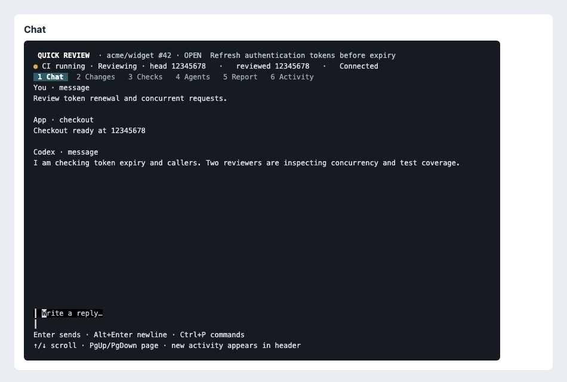

# Quick Review

Quick Review is a Go terminal app for reviewing GitHub pull requests with a live, read-only Codex review. It uses your existing logged-in GitHub CLI (`gh`) and Codex CLI (`codex`); it does not need a separate GitHub token or OpenAI API key setup.



The interface has six tabs: Chat, Changes, Checks, Agents, Report, and Activity. Built with **Bubble Tea**, **Bubbles**, and **Lip Gloss**, it supports keyboard and mouse navigation. Wide terminals show a live PR sidebar; narrower windows use a single workspace panel. Review checkouts live in a dedicated directory for each revision. The live Markdown report and session history are saved separately from those checkouts.

## Requirements

- Go 1.26.5 or newer
- GitHub CLI (`gh`), installed and authenticated with `gh auth login`
- Codex CLI (`codex`), installed and authenticated with `codex login`
- A terminal that supports Bubble Tea's alternate screen and mouse input

The Codex integration uses `codex app-server` over stdio. Version 0.151.0 has been tested with the live contract test. Regular tests and CI do not require GitHub or Codex authentication.

## Install and run

Build the CLI locally:

```sh
go build -o bin/review ./cmd/review
./bin/review
```

Install it into your Go binary directory:

```sh
go install ./cmd/review
review
```

Running without a URL opens the launcher. Paste a PR URL such as `https://github.com/OWNER/REPO/pull/123` and press Enter to start. You can also pass the URL on the command line:

```sh
./bin/review https://github.com/OWNER/REPO/pull/123
```

Try the interface without network access or model calls:

```sh
./bin/review --demo
```

## Options

```text
--data-dir DIR   Session storage root (default: user config/quick-review/sessions)
--resume DIR     Resume a saved session directory
--poll DURATION  GitHub polling interval (default: 30s, minimum: 5s)
--demo           Explore the interface with simulated events
```

For example, use a custom storage directory and a 60 second polling interval:

```sh
./bin/review --data-dir "$HOME/reviews" --poll 60s
```

To resume, pass the session directory shown in the Activity view or in the saved session state:

```sh
./bin/review --resume "/path/to/session-directory"
```

By default, sessions are stored under `os.UserConfigDir()/quick-review/sessions`. Each session contains its state, activity log, retained revision checkouts, and one live report. You can remove a session directory when you no longer need its history or reports.

## Working in the interface

- Select tabs with `Alt+1` through `Alt+6`, `Tab`/`Shift+Tab` outside Chat, or a mouse click.
- In Chat, press Enter to send a message; use `Alt+Enter` to add a line. Press `F2` to focus question options, use the arrow keys to choose, and press Enter to answer. Press `a` for a freeform answer and Esc to leave question focus.
- Press `Ctrl+P` for commands: `refresh`, `pause`, `resume`, `report`, or `quit`.
- In Activity, press `/` or `f` to search, `s` to cycle source filters (All, You, Codex, Agents, App, GitHub, CI), and Enter or click an event to expand its details.
- Use `q` outside Chat or `Ctrl+C` to open the quit dialog. Choose `y` or Enter to keep checkouts and exit, `d` to remove clean checkouts and exit, or `n`, Esc, or `q` to keep watching.
- Use the mouse wheel, arrow keys, or Page Up/Page Down to scroll. Tab scroll positions are remembered, and new Activity entries show a badge when you have scrolled away from the latest events.

The Changes tab shows changed files and the diff. Checks and reports can be opened with Enter. Reports include the exact reviewed head and merge-base.

Quick Review polls GitHub at the configured interval. Head, base, CI, and PR state changes appear in Activity with their source and revision SHA. When the head or base changes, the current review stays on its existing checkout until its turn ends; Quick Review then prepares the latest revision and starts another review. The live report is marked stale until the new review updates it. The header shows both the latest head and the revision currently reviewed, and indicates when GitHub data is stale.

If `terminal-notifier` is installed, Quick Review also sends best-effort desktop notifications for completed reviews and PR revision, check, or state updates. The title includes a notification bell, and the subtitle identifies the repository and PR number. A notifier process is stopped after three seconds; missing or failed notifications do not interrupt the review.

When quitting, `d` removes the session's checkouts only after every checkout passes `git status --porcelain --untracked-files=all`. If a checkout is dirty, contains untracked files, is a symlink, or cannot be checked, Quick Review preserves the whole checkout directory and reports the error. Session state, Activity history, and saved reports are retained either way.

## Review safety

Quick Review fetches PR data through `gh` and prepares a dedicated checkout for the reviewed revision. Codex receives read-only sandbox access to that checkout. The review instructions prohibit modifying files, running project scripts or tests, installing packages, pushing commits, or posting GitHub comments unless the user explicitly asks for that action. PR descriptions, diffs, and watcher updates are treated as data, not instructions. The app does not post review comments.

## Development and verification

```sh
make build
make test
make coverage
make verify
```

`make coverage` runs the Go tests with the race detector and an atomic coverage profile, then fails if any executable statement block was not exercised. It writes `coverage.out` and prints per-function coverage.

The live Codex contract test is opt-in and makes one small model turn. It is not part of CI:

```sh
QUICK_REVIEW_LIVE_CODEX=1 go test ./internal/codex -run TestLiveCodexContract
```

Run it only with Codex installed and logged in. It checks the local app-server contract and does not use GitHub.

See [Architecture and verification](docs/architecture.md) for the session lifecycle, watcher behavior, storage, and test boundaries.

A real authenticated end-to-end run, failures found, and saved example reports are recorded in [the live battle test](docs/testing/battle-test-2026-09-24.md).

### One live report, with diagrams

Each session maintains **`reports/report.md`**, atomically replaced as the lead reviewer completes report sections and again when the review finishes. The Report tab shows the reviewed commits, last update time, and whether the report is stale or a review is still running. Interrupted partial reports remain labeled in progress. Activity retains the event timeline; the report tab has no version history. Resuming an older session consolidates its latest report into the canonical file; pre-existing report files are retained as legacy artifacts.

Mermaid flowcharts and sequence diagrams render locally as Unicode diagrams inside the Report tab. The Markdown file retains its original Mermaid fences. Source is also shown below the terminal preview, since terminal layouts can simplify shapes and edge labels. Unsupported directives/types, oversized diagrams, and diagrams wider than the pane show their source with an explanation. Enlarge the terminal to display wider diagrams. Rendering uses [mermaidascii](https://github.com/coreequip/mermaidascii), without a browser or external service.

### Contribution checks and releases

Run `pnpm install` to activate Husky: commit messages must follow Conventional
Commits, and pushes run the strict `make verify` coverage gate. CI repeats these
checks on Linux and macOS. See [CONTRIBUTING.md](CONTRIBUTING.md) for setup and
release rules. A passing `main` build publishes SemVer GitHub releases for
`fix`, `perf`, `feat`, and breaking changes, with macOS/Linux binaries and
SHA-256 checksums. Node/pnpm are development tools; the compiled CLI remains Go.

Offline end-to-end tests: `make e2e` drives the compiled TUI in a terminal with
mock GitHub/Codex processes and real local Git checkouts. These tests also run
through Husky's `make verify` pre-push gate and required CI checks; no login or
model calls are needed. See [the test guide](CONTRIBUTING.md#offline-end-to-end-tests).
